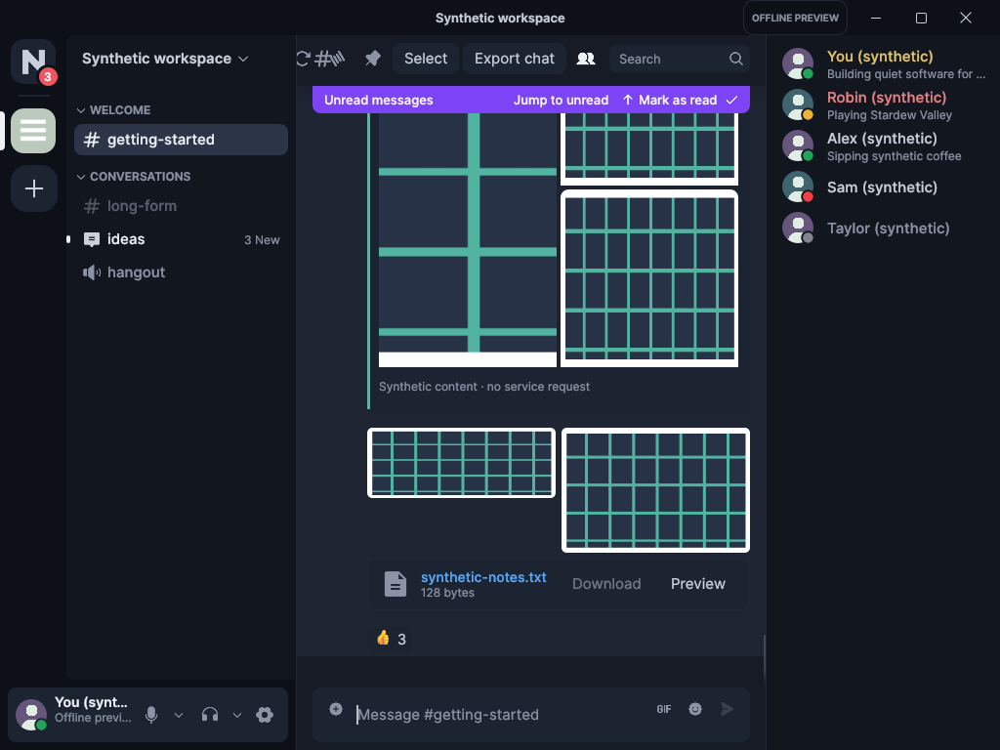
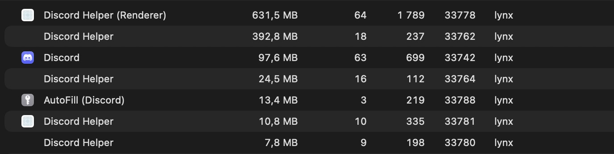
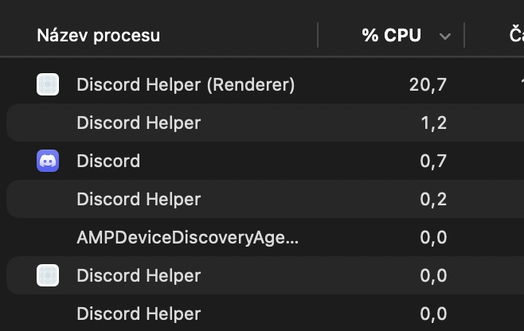
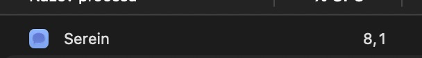

# Nivra

<p align="center">
  <a href="https://github.com/vitorhubdev/Nivra">
    
  </a>
</p>

<p align="center">
  <strong>Unofficial native Discord client in Rust (egui + wgpu) for Windows, Linux and macOS.</strong>
</p>

<p align="center">
  <a href="#download"><strong>📦 Download</strong></a> &nbsp;•&nbsp;
  <a href="#highlights"><strong>⚡ Highlights</strong></a> &nbsp;•&nbsp;
  <a href="#benchmarks"><strong>📊 Benchmarks</strong></a> &nbsp;•&nbsp;
  <a href="#build-from-source"><strong>🛠️ Build</strong></a> &nbsp;•&nbsp;
  <a href="#feature-matrix"><strong>📋 Features</strong></a> &nbsp;•&nbsp;
  <a href="#architecture"><strong>🏗️ Architecture</strong></a> &nbsp;•&nbsp;
  <a href="#whats-new"><strong>🆕 What's new</strong></a>
</p>

<p align="center">
  <a href="https://github.com/vitorhubdev/Nivra/releases/latest"></a>
  <a href="Cargo.toml"></a>
  <a href="crates/ui"></a>
  <a href="docs/platform-support.md"></a>
  <a href="LICENSE-MIT"></a>
</p>

---

> [!WARNING]
> **Unofficial and not endorsed by Discord.**
> Nivra is a modified Serein fork that talks to Discord's public gateway and REST endpoints with your existing account. Automating normal accounts outside the official OAuth2/bot API violates Discord's Terms of Service and carries a risk of account termination. Technical interoperability does not imply platform approval. Review the [compatibility matrix](docs/discord-compatibility.md) and the [authentication guide](docs/authentication.md) before use.

---

## Download

Stable builds are published on the [Releases page](https://github.com/vitorhubdev/Nivra/releases/latest). On Windows, download the single `.exe` and open it: there is nothing to extract. Installers, Flatpaks, AppImages, Homebrew packages or package repositories published by upstream Serein are not Nivra binaries.

| System | Asset (v1.0.12 example) | Notes |
| --- | --- | --- |
| Windows x64 | `Nivra-v1.0.12-Windows-X64.exe` | Single executable, no installer |
| Windows ARM64 | `Nivra-v1.0.12-Windows-ARM64.exe` | Maximum noise suppression (DeepFilterNet) is unavailable and falls back to RNNoise |
| Linux x64 | `Nivra-v1.0.12-Linux-X64.tar.gz` | Extract and run |
| macOS Apple Silicon | `Nivra-v1.0.12-macOS-ARM64.zip` | Intel macOS is not published |

Every release also attaches a `SHA256SUMS.txt` checksum file. Verify the file you downloaded before running it:

```powershell
# Windows (PowerShell) — compare the output with the matching line in SHA256SUMS.txt
Get-FileHash .\Nivra-v1.0.12-Windows-X64.exe -Algorithm SHA256
```

```sh
# Linux — checks the files that are present and ignores the rest of the manifest
sha256sum --ignore-missing -c SHA256SUMS.txt
# macOS — compare the printed hash with the matching line in SHA256SUMS.txt
shasum -a 256 Nivra-v1.0.12-macOS-ARM64.zip
```

**These builds are not code-signed.** On Windows, SmartScreen may show *"Windows protected your PC"*: choose **More info** → **Run anyway**. On macOS, Gatekeeper may block the first launch of the `.app`: right-click it, choose **Open**, and confirm; macOS also allows it later under System Settings → Privacy & Security.

---

## Highlights

Nivra is built around three voice pillars, each covered by an offline, measured test suite (details in [CHANGELOG.md](CHANGELOG.md) and [docs/voice.md](docs/voice.md)):

- **Pillar 1 — clear voice (noise suppression).** Four modes: Off, Light (WebRTC), Standard (RNNoise) and Maximum (DeepFilterNet), with a crossfade between modes so a switch never clicks. The benchmark keeps the p99 cost under 5,000 µs per 10 ms frame with zero budget blowouts: Off 0/0, Light 50/58, Standard 55/90, Maximum 97/138 µs (p50/p99). The Maximum figure measures the synthetic worker path, not the real model. DeepFilterNet is unavailable on Windows ARM64, where Nivra falls back to RNNoise.
- **Pillar 2 — calls that stay up.** Two synthetic clients exchange decoded, DAVE-encrypted audio (450/650 Hz tones, at least 60 frames per direction); a 10-second UDP blackout recovers without rejoining; switching a device during a call, 50 join/leave cycles and 20 channel switches all pass.
- **Pillar 3 — you are told about everything.** Every voice-state update paints the right icon in one frame; join, leave, mute, unmute, deafen and call drop/reconnect cues go through ordered, identity-deduplicated queues that keep the newest bounded set when full. The cues play with the window focused, minimized or hidden in the tray, and join/leave also raise a system notification with the member name.

These pillars are synthetic, offline tests. Live Discord interoperability and physical microphone/speaker behavior remain unverified.

**Measured performance:** in the benchmark scenario below, Nivra used about **9× less RAM** and **2.8× less CPU** than the official Electron client — one process instead of seven helpers.

**Recently added** (1.0.9–1.0.12):

- **File previews:** text, Markdown and code previews reopen, follow Discord redirects, renew expired links and show an honest limit for oversized files; the Licenses screen opens again.
- **Video at any resolution:** previews from 640×360 up to about 16 megapixels (e.g. 4500×3000) scale into the preview box (1920×1080 landscape, 1080×1920 portrait) without upscaling; playing a video no longer freezes the app; codecs the system cannot decode (HEVC, AV1 or VP9 without the Windows extension) do not play and the card states the real reason with Download video / Open original.
- **Windows DLL protection:** the executable resolves its dependencies only from System32 and warns — without blocking — when system-named DLLs sit next to it.
- **Local error log:** errors from the main paths (downloads, attachment previews, window compositing, app registration) go to a rotating, redacted log (5 files × 2 MiB); if the app panics, the next launch shows a crash report, and Settings > Help has "Copy error log" and "Open logs folder". Nothing is sent anywhere automatically; a few internal diagnostics (update handoff, tray fallback, GPU/video) still only reach the console.
- **Motion and clarity:** one motion token set with a "Reduce motion" switch (Settings > Appearance); disabled icon buttons explain why on hover; destructive actions get one confirmation.
- **Also in this round:** Push to Mute on mouse 4/5 (unassigned by default), the Windows tray voice-state icon, compact timeline layout, HEIC preview via Windows WIC, Discord polls, single-instance lock, and ~3% smaller Windows executables.

---

## Benchmarks

> **Testing scenario:** browsing channels while joined in a voice channel and streaming screen at 60 FPS, on macOS.

| Metric | Official Discord Client (Electron) | Nivra (Native Rust + egui/wgpu) | Advantage |
|---|:---:|:---:|:---:|
| **Memory (RAM)** | **1,178.4 MB** *(across 7 helper processes)* | **129.7 MB** *(single unified process)* | **~9× less memory (-89%)** |
| **CPU Usage** | **22.8%** *(Renderer + Helper processes)* | **8.1%** | **~2.8× lower CPU (-64%)** |

| Official Discord (Electron) | Nivra (Native Rust) |
| :---: | :---: |
| **RAM: ~1,178.4 MB across 7 processes** | **RAM: 129.7 MB single process** |
|  |  |
| **CPU: 22.8% total** | **CPU: 8.1% total** |
|  |  |

---

## Build from source

### Prerequisites

Rust **1.98.1** is pinned (see `rust-toolchain.toml`); the current workspace version is **1.0.12**. You also need the standard C/C++ toolchain, CMake and `bun` 1.4.2 for the JS test harnesses:

- **macOS:** Xcode command-line tools (`xcode-select --install`)
- **Linux:** GCC/Clang, ALSA development headers, `pkg-config`, GTK 4, WebKitGTK 6.0, GStreamer, fontconfig and Vulkan drivers (see [Platform Support](docs/platform-support.md))
- **Windows:** Visual Studio C++ build tools and the WebView2 Runtime

### Running locally

```sh
git clone https://github.com/vitorhubdev/Nivra.git
cd Nivra

# 1. Release build of the standard client with voice
cargo build --locked --release -p nivra

# 2. Run it from source (uses the saved login or the official sign-in webview)
cargo run --locked

# 3. Offline synthetic demo (no network, synthetic state)
cargo run --locked -p nivra --features demo -- --demo
```

The demo makes no network requests and uses synthetic state; it still performs the normal local startup migration (data folder, keyring entries, shortcuts) like any other launch.

### Workspace commands

```sh
# Run full workspace validation (formatting, Clippy, tests, policy checks)
cargo xtask check

# Run the release reducer benchmark (not an RSS or frame-timing measurement)
cargo replay

# Run the authentication bridge JS test harness
node tests/login-handoff.cjs

# Package the release including voice (macOS .app bundle, Linux .deb by default)
cargo xtask package
```

Interface text lives in one file per language under `crates/ui/locales/`; adding a language is adding a file, with no screen changes — see [Languages](docs/i18n.md). Platform-specific runtime and build requirements remain documented under [Platform Support](docs/platform-support.md) and in the `packaging/` directory.

---

## Feature matrix

| Capability | Status | Notes |
|---|---|---|
| **Navigation & Guilds** | Implemented | Collapsible categories, cached icons, guild channels, forum channels, active threads, DM lists, People pane, and server channel context menus |
| **Message Timeline** | Implemented | Virtualized variable-height rows, inline link confirmations, spoiler text/media reveal, unread message banners, deleted message protector, local timezone timestamps, and a compact layout option (time \| author \| text) |
| **Markdown & System Messages** | Implemented | Bold, italics, code blocks, blockquotes, clickable links, and styled system events with tinted Phosphor icons and clickable member names |
| **Reactions & Emojis** | Implemented | Twemoji rendering, native reaction counts, eight-emoji quick picker, full emoji picker, custom guild emojis, and add/remove reaction controls |
| **Polls** | Implemented | View, vote, unvote, live results and closed state. Voting uses the unofficial normal-user route and has not been validated on a live account |
| **GIFs & Media Search** | Implemented | KLIPY GIF picker with search, favorites category, and one-click direct sending |
| **User Mentions & Autocomplete** | Implemented | Clickable user mentions with interactive composer autocompletion and visual highlight styling |
| **Media Previews & Video Player** | Implemented | Inline MOV/MP4 playback from 640×360 up to about 16 megapixels, first-frame poster, drag-seek, and per-failure reasons with retry/download/open; image viewer, Windows WIC HEIC preview, text/Markdown preview, and media copy/save context menus |
| **File & Attachment Uploads** | Implemented | Multi-attachment batch staging with file-type badges (PDF, ZIP, STL, images), thumbnails, per-file removal, upload progress, and drag-and-drop |
| **Voice Engine & Calls** | Implemented | 1-to-1/group DM calls and server channels, Opus, DAVE v1 E2EE, Sonora AEC3 echo cancellation, noise suppression Off/Light (WebRTC)/Standard (RNNoise)/Maximum (DeepFilterNet — falls back to RNNoise on Windows ARM64), push-to-talk (`V`), Push to Mute (mouse 4/5, unassigned by default), and device selectors |
| **Voice Messages** | Implemented | Inline voice message playback with interactive waveforms and bounded streaming audio buffering |
| **Screen Sharing & Video** | Implemented | Native screen capture (macOS ScreenCaptureKit, Windows Graphics Capture, Linux portal/PipeWire with VA-API/NVENC hardware encoding and software fallback; Linux native capture remains unverified), quality presets (720p/1080p, up to 60 fps), and local camera/screen previews |
| **Camera Video & Stream Viewing** | Implemented | Hardware-accelerated decoding (macOS VideoToolbox, Linux VA-API, Windows DXVA/D3D11) for incoming screen streams and camera feeds |
| **System Tray** | Implemented | Closing the window hides it to the tray by default, with re-open and Quit in the tray menu; Windows shows the voice state (active, muted, deafened, idle); call cues and notifications work while the window is hidden |
| **Threads & Forum Channels** | Implemented | Forum post listing, recent-activity sorting, active thread browsing, and new forum post / thread creation |
| **Server Administration** | Implemented | Server profile editor (banners, icons, traits), role management with permissions matrix, audit log viewer, invite tracking and revocation, integrations/webhooks, and member moderation |
| **Extensions & Theme Shop** | Implemented | Git-backed plugins, community theme catalog with preview cards and color presets, permission prompts, and a deleted-message protector |
| **Keybinds & Shortcuts** | Implemented | In-app keybind cheat sheet with raised keycaps, quick edit (`Up`), quick delete (`Backspace`), keyboard navigation; global shortcuts stay off until enabled in Settings > Keybinds |
| **Rich Presence & Game IPC** | Implemented | Discord IPC and WebSocket RPC servers plus running-game detection; shows activities in member rosters, DMs and profiles |
| **Profile Cards & Editing** | Implemented | On-demand profile popouts with banners, bios, badges and connections; in-app editor for display name, bio, pronouns and accent color with live preview |
| **Server & Group Actions** | Implemented | Server dropdown with friend invites and leave server; group DM actions (edit name/icon preview, mute, leave) |
| **Context Menus & Shortcuts** | Implemented | Right-click context menus for messages, media (save/copy), server channels and members |
| **Typing Indicators** | Implemented | Shows incoming typing with short expiry; Nivra strictly avoids emitting outgoing typing signals |
| **Diagnostics & Error Log** | Implemented | Rotating local log (5 × 2 MiB) for the migrated paths (downloads, previews, compositing, app registration) with tokens, cookies, e-mails, IDs and message text never written; panic report on the next launch; Copy error log / Open logs folder in Settings > Help; nothing is uploaded |
| **Persistence & Drafts** | Implemented | Bounded SQLite cache for history, drafts, settings and diagnostics; OS credential store for auth tokens; sanitary logout |
| **Internationalization** | Implemented / partial | English, Português (Brasil) and Español available; CJK and Arabic fallback fonts included; full IME and bidirectional editing unverified |

---

## Architecture

Nivra is engineered as a clean multi-crate Cargo workspace, isolating UI rendering from networking, persistence and service protocols:

```
nivra/
├── apps/
│   └── desktop/          # Application entrypoint, CLI flags, window lifecycle
├── crates/
│   ├── client-core/      # Client state coordinator, generation tracking, events
│   ├── session-cache/    # In-memory bounded cache and state reconciliation
│   ├── ui/               # egui widgets, message virtualizer, themes, design tokens
│   ├── model/            # Strongly-typed Discord domain entities
│   ├── discord-protocol/ # Wire protocol serialization and partial payload patches
│   ├── discord-api/      # HTTP/2 REST client with rate limiting and backoff
│   ├── discord-gateway/  # WebSocket gateway client with heartbeat and resume
│   ├── discord-voice/    # Opus codecs, RTP/UDP transport, DAVE v1, AEC3, RNNoise/DeepFilterNet, video decoding
│   ├── local-store/      # Bounded SQLite database for history, drafts, settings
│   ├── platform/         # OS credential store, tray, notifications, shortcuts, diagnostics/logging
│   └── test-support/     # Deterministic synthetic fixtures and mocks
└── tools/
    ├── replay-bench/     # Benchmarking harness for state reducers
    └── xtask/            # Workspace automation tasks (packaging, checks, linting)
```

---

## Security and privacy

- **Token protection:** Tokens are saved solely in the native OS credential store (macOS Keychain, Windows Credential Manager, Linux Secret Service). A plaintext token fallback is strictly prohibited, and active tokens remain redacted in memory.
- **Bounded local cache:** SQLite databases store recent channel history, drafts, settings, diagnostics and image-preview metadata within bounded byte and count limits. The local SQLite store is **not** encrypted by the application.
- **Sanitary logout:** An explicit logout destroys active network sessions, purges active secrets from memory, deletes the token from the OS credential store, and erases that account's local cache and drafts.
- **No telemetry:** Nivra contains no analytics, telemetry, tracking beacons, third-party relay or background crash collector. Nothing is uploaded automatically and there is no reporting service.
- **Local, redacted error log:** Errors from the migrated paths (downloads, attachment previews, window compositing and application registration) are written to rotating local files (5 × 2 MiB). Tokens, cookies, e-mail addresses, channel/message IDs and message text are never written. If the app panics, a redacted report is kept and shown on the next launch (a native crash, forced kill or power loss does not produce one); Settings > Help offers "Copy error log" and "Open logs folder". On Windows the folder is `%LOCALAPPDATA%\nivra\logs`; on Linux and macOS it is `nivra/logs` under the platform's local data directory. Some internal diagnostics (update handoff, tray-icon fallback, GPU/video) still only reach the console. You decide whether to attach the log to an issue — it is never sent for you.
- **Platform integrity:** No fingerprint spoofing, CAPTCHA/MFA bypasses, bot substitutions, token scrapers or third-party relays.

For full details, review the [Storage Policy](docs/storage-policy.md) and [Threat Model](docs/threat-model.md).

---

## Documentation

- [Architecture & Monorepo Design](docs/architecture.md)
- [Discord Compatibility & Protocol Details](docs/discord-compatibility.md)
- [Authentication & Login Handoff](docs/authentication.md)
- [Storage Policy & Cache Retention](docs/storage-policy.md)
- [Platform Support & Build Requirements](docs/platform-support.md)
- [Voice Architecture & Procedure](docs/voice.md)
- [Design Tokens & UI Styling](docs/design.md)
- [Languages & Locale Files](docs/i18n.md)
- [Extensions & Plugin Architecture](docs/extensions.md)
- [Extension SDK Overview](docs/extension-sdk-overview.md)
- [Extension SDK Reference](docs/extension-sdk-reference.md)
- [Extension SDK Actions](docs/extension-sdk-actions.md)
- [Extension SDK Troubleshooting](docs/extension-sdk-troubleshooting.md)
- [SDK Examples and Offline Authoring Guide](examples/extensions/README.md)
- [Theme API Specification](docs/theme-api.md)
- [Threat Model & Security](docs/threat-model.md)
- [Serein extension wiki (upstream reference)](https://github.com/ViceVerse-cz/Serein/wiki) — the original Serein project's wiki; Nivra has no wiki of its own
- [Third-Party Licenses & Notices](THIRD_PARTY_NOTICES.md)

---

## Reporting problems

Report Nivra issues at [vitorhubdev/Nivra/issues](https://github.com/vitorhubdev/Nivra/issues); do not file Nivra bugs upstream. Include the app version (Settings > About, or `--version`), your OS and version, and steps to reproduce. If Nivra logged an error, open **Settings > Help** and press **Copy error log**; paste it into the issue if you are comfortable sharing it. If the app panicked, the next launch shows a crash report with **Copy report**.

---

## What's new

### 1.0.12

- Text preview and the Licenses screen open again; oversized files and expired links show the right message, and the account card keeps its content height.
- Video preview accepts any resolution from 640×360 up to about 16 megapixels; HEVC/AV1 without a system decoder still do not play.
- Call cues play while the window is minimized or hidden in the tray, with a 64-cue queue and member-name notifications on join/leave.
- Windows DLL hardening plus a local, redacted rotating error log, panic report and Settings > Help tools.
- One motion token set with a "Reduce motion" option, hover explanations for disabled buttons, and a single confirmation for destructive actions.
- Windows executables are about 3% smaller.

### 1.0.11

- The video freeze is fixed (egui context re-lock); audio-less clips play to the end, the card shows a first frame before Play, and a stall watchdog writes a bounded `nivra-freeze.log`.
- The measured three-pillar voice suite above ships with numbers; noise suppression, DAVE audio exchange, UDP-blackout recovery and cue queues are covered by tests.
- Push to Mute (mouse 4/5), Windows tray voice-state icon, compact timeline layout, HEIC preview and Discord polls.

Older releases (SereinExt 1.0.1–1.0.4 and Nivra 1.0.5 onward) are documented in [CHANGELOG.md](CHANGELOG.md). Upstream Serein documentation can still be useful as technical reference, but its downloads belong to the original project, not this fork.

---

## Origin & attribution

Nivra originated as an independent fork of
[Serein](https://github.com/ViceVerse-cz/Serein),
developed by the Serein contributors and ViceVerse-cz.

Nivra is independently maintained by
[vitorhubdev](https://github.com/vitorhubdev)
and has since developed its own fixes, features, integrations,
branding and release lifecycle.

Original Serein code remains copyright the Serein contributors
and is available under MIT OR Apache-2.0.

Nivra is not affiliated with, endorsed by, or an official client
of Discord Inc.

---

## License

Original Serein code is dual-licensed under either:
- **MIT License** ([LICENSE-MIT](LICENSE-MIT))
- **Apache License, Version 2.0** ([LICENSE-APACHE](LICENSE-APACHE))

at your option. Third-party library notices, bundled font licenses (Inter, Noto Sans CJK/Arabic), and Twemoji graphics licenses are cataloged in [THIRD_PARTY_NOTICES.md](THIRD_PARTY_NOTICES.md).

Demo fixtures and simulated actions are excluded from normal app and CI packages.
Build with `--features demo` and launch with `--demo` to enable them; `--demo-*`
scenario flags additionally require `--demo`. `cargo xtask package` always builds
without demo support, while offline tests can still use synthetic fixtures.

---

## Português

O Nivra é um cliente Discord nativo e não oficial, escrito em Rust (egui + wgpu) para Windows, Linux e macOS. No cenário de teste medido (macOS, canais abertos em chamada de voz com transmissão de tela a 60 FPS), ele usou cerca de 9× menos memória que o cliente oficial; tem voz clara (supressão de ruído DeepFilterNet no modo Máximo), toca os sons da chamada com a janela minimizada e mantém um log de erros local — nada é enviado sozinho. Baixe a versão mais recente na página de [Releases](https://github.com/vitorhubdev/Nivra/releases/latest): no Windows é um único `.exe` sem assinatura (o SmartScreen pode avisar; escolha "Mais informações" e "Executar assim mesmo"). Para reportar um problema, abra uma [issue](https://github.com/vitorhubdev/Nivra/issues) com a versão do app, o sistema e os passos, e use "Copiar log de erros" em Configurações > Ajuda se quiser anexar o log. O Nivra não é afiliado ao Discord e usar uma conta normal com ele é por sua conta e risco.
